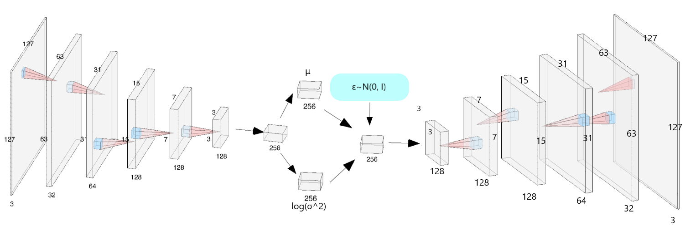

# DogVAE

A Variational Autoencoder (VAE) that generates images of dogs.

## What is an Autoencoder and how can we improve?

An autoencoder is a neural network architecture that seeks to encode an input into a (usually smaller) latent space in such a way that it can be decoded back into the original input.

In the case of image generation, you can train an autoencoder using convolutions to first transform an image into a vector (known as the latent space) back into an image. The loss of such a network would the **reconstruction loss**: the difference between the input and the reconstructed output.

Theoretically, you could pick any vector in the latent space and it would map to a valid dog. However, this doesn't really work in practice. Why? Because there is no way to "sample" from the latent space, we're forced to just choose random values for each component of the vector. Unless you have a super dense latent space where every possible vector maps to a dog (unlikely), it's just going to be garbage in, garbage out.

## Why are Variational Autoencoders the answer?

Ideally, we can fit the latent space to some type of distribution that we know a priori. If we can accomplish that, then we can sample from the distribution to get new dog pictures. Variational Autoencoders do exactly this by fitting the latent space to a multivariate Gaussian.

In a VAE, the first third of the model is exactly same as the autoencoder: use a series of convolutions to transform a picture into a vector. However, in a VAE, the model transforms that vector into vectors $\mu$ and $log(\sigma^2)$ and samples the input to the decoder $z \sim ~ N(\mu, \sigma)$. When the reconstructed output is created, the loss is computed as a sum between the aforementioned reconstruction loss and a [KL-Divergence](https://en.wikipedia.org/wiki/Kullback%E2%80%93Leibler_divergence) loss, a measure of distance between distributions.

The KL-Divergence term will encourage the latent space to follow a multivariate Gaussian while the reconstruction loss term makes sure that the reconstructed output is still similar to the input.

From there, creating new dog images is as simple as passing new latent vectors $z \sim ~ N(\mu, \sigma)$ through the decoder! 

## Why so blurry?
By nature, the output of VAEs are often blurry. Why? In our case of dog image generation, we have $127 * 127 * 3 = 48387$ floats in the original image. Compare this to a latent space size of $256$ and that's $48387 / 256 \approx 190$ times smaller! There's an inordinate amount of information being lost through the network, so the model only learns the most important features of the image, missing some of the details. 

## Why not GANs?
GANs, or [Generative Adversarial Networks](https://en.wikipedia.org/wiki/Generative_adversarial_network), on the other hand, have been shown to produce much crisper outputs and clearly don't suffer from the information bottleneck issue. Why would anyone choose a VAE over a GAN? The main issue with GANs is that they often [fail to converge](https://developers.google.com/machine-learning/gan/problems). While people have been making efforts to create a system of [GAN "best practices"](https://github.com/soumith/ganhacks) to increase the odds of convergence, getting GANs to converge is, as of writing this, an unsolved problem.